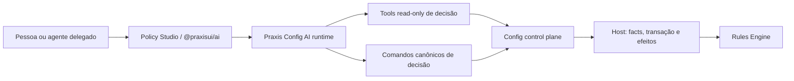

# ADR 0002 — fronteira do Policy Assistant

- Estado: proposto para implementação incremental
- Data: 2026-08-14
- Classe: arquitetural, transversal e futuro contrato público

## Contexto

O Policy Studio precisa permitir que pessoas e agentes encontrem, expliquem,
criem, editem, testem e operem decisões. A plataforma já possui no Praxis Config
e no `@praxisui/ai` infraestrutura horizontal para providers, resolução semântica
de intenção, conversas, SSE com replay/cancelamento, clarificação, registry de
tools, identidade e evidência sanitizada.

Esse runtime hoje reconhece intenções de shared rules principalmente para impedir
que o Page Builder trate uma decisão de domínio como patch de página. O handoff
consultivo não executa a jornada de decisão e não existe projeção de evidência
específica para explicar uma regra. Criar um segundo motor LLM no Policy Studio
duplicaria sessão, segurança, tools, observabilidade e roteamento.

## Decisão

O Policy Assistant reutilizará o runtime canônico de IA do Config e o transporte
público de `@praxisui/ai`. O Policy Studio materializará a experiência, mas não
possuirá provider, API key, roteador de intenção, persistência de conversa ou
executor paralelo.

Será introduzida a especialização semântica `domain_decision` no owner canônico.
O roteamento inicial será LLM-first e semanticamente grounded; palavras-chave,
regex e fuzzy matching podem apenas ranquear candidatos depois que a intenção e
o escopo forem resolvidos.

O agente usará os mesmos comandos, capabilities, ETag, blockers, auditoria e
segregação de funções das pessoas. Não haverá uma API privilegiada de IA.

## Níveis de autonomia

1. **Explicar e localizar:** read-only, sem confirmação destrutiva; toda afirmação
   relevante referencia versão, fingerprint e evidência.
2. **Propor:** o modelo produz intenção tipada, diff semântico, ambiguidades,
   diagnostics e cenários sugeridos; nada é persistido como regra sem comando.
3. **Criar/editar/testar/submeter:** comando explícito, principal autenticado,
   capability adequada, ETag/base revision e resultado auditável.
4. **Publicar/operar:** permitido futuramente como ação delegada somente quando a
   mesma persona humana poderia fazê-lo, com confirmação contextual, action
   server-owned e revalidação de blockers. O agente não aprova a própria proposta,
   não combina papéis incompatíveis e não altera authority por inferência.

“IA não publica” não é uma fronteira permanente. A fronteira permanente é: IA
não contorna autorização, evidência, confirmação, concorrência ou SoD.

## Primeiro incremento: explicação read-only

O Config deve publicar uma projeção sanitizada de evidência para uma decisão:

- identidade, versão, status e fingerprint;
- condição validada e operadores em forma explicável;
- facts, tipos, nullable, origem e semântica de missing/null;
- precedência, dependencies, reason codes e materializações;
- provenance, timeline segura, Test Runs e reviews;
- snapshot/authority atual e limites explícitos da evidência;
- nenhuma credencial, fact sensível, payload de banco ou dado individual.

Antes de criar novo DTO, devem ser inventariados Definition detail, timeline,
lifecycle, Test Run provenance, execution summary, materializations e metadata de
facts já publicados. A nova projeção só pode agregar o que uma explicação correta
não consegue obter dessas superfícies.

Tools iniciais:

- `searchDomainRules`: busca paginada no read model canônico, depois da intenção
  semanticamente resolvida;
- `getDomainRuleExplanationEvidence`: read-only, exige papel leitor e devolve a
  projeção sanitizada;
- `proposeDomainRuleChange`: posterior, devolve proposta tipada e nunca persiste
  por si só.

O resultado do assistente deve usar um bloco de decisão próprio, com versão,
authority, facts, precedência, explicação, evidências e incertezas. Ele não deve
degradar para paragraph genérico, lista de recursos ou JSON Logic bruto.

## Authoring e operação posteriores

O executor de comandos de decisão chamará `DomainRuleService`/serviços de
workspace. `AgenticAuthoringApplyService`, page-preview e manifests de componente
não serão reutilizados para regras, pois o owner deles é `ui_user_config` e patches
de página.

Ordem incremental:

1. localizar e explicar;
2. propor cenários e expected outcomes;
3. propor diff de condição/parâmetros com grounding;
4. criar/editar workspace e executar Test Runs;
5. resumir review e impacto sem atuar como aprovador;
6. preparar e, quando autorizado, executar publish/rollout/rollback como comando
   delegado confirmado.

## Segurança e ameaça

- prompt injection em descrição/evidência é conteúdo não confiável e nunca muda
  tool, capability ou policy;
- tools validam tenant/environment/principal no servidor;
- o browser não fornece API key corporativa;
- facts e traces obedecem redaction e autorização específicas de logs;
- confirmação contém alvo, versão, ambiente, efeito e blockers atuais;
- toda mutation é idempotente quando aplicável e usa ETag/base revision;
- tool output referencia correlation/decision/result events para auditoria;
- falha de provider, grounding ou evidence resulta em clarificação ou recusa, não
  em comando aproximado.

## Aderência à plataforma

| Necessidade | Classificação | Decisão |
| --- | --- | --- |
| provider, streaming, conversa e clarificação | `ja-suportado-so-ux` | reutilizar Config e `@praxisui/ai` |
| reconhecimento de shared rules | `ja-suportado-mal-nomeado-ou-mal-materializado` | transformar handoff consultivo em domínio `domain_decision` |
| busca de definitions | `suportado-parcialmente` | criar read model paginado sobre identidade canônica existente |
| explicação causal com evidência | `lacuna-real-de-contrato` | agregar projeção sanitizada no Config após inventário |
| create/edit/test humano | `suportado-parcialmente` | expor os mesmos comandos como tools, sem executor paralelo |
| publish/rollout pela IA | `suportado-parcialmente` | só após actions completas, confirmação e SoD comprovados |

## Consequências

- não será criado outro motor LLM nem backend AI no Studio;
- `@praxisui/ai` deixa de ser dependência ociosa quando o primeiro slice chegar;
- a primeira entrega de IA pode ser útil antes do authoring complexo completo;
- ações humanas e de IA permanecem semanticamente idênticas e auditáveis;
- mudanças futuras em tools/manifests exigem documentação pública, corpus HTTP,
  recipes e testes de segurança como artefatos derivados.
