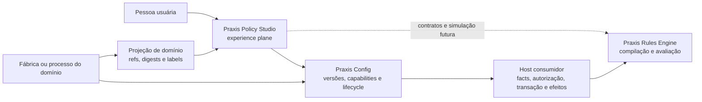
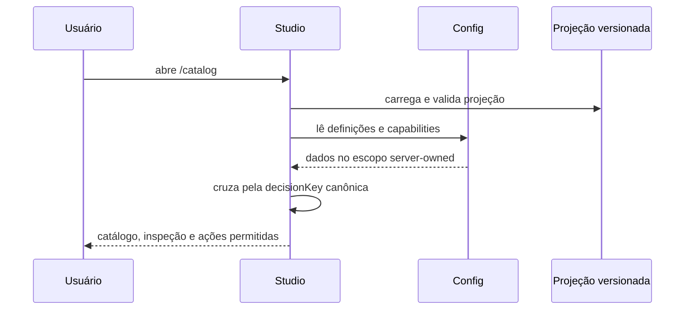
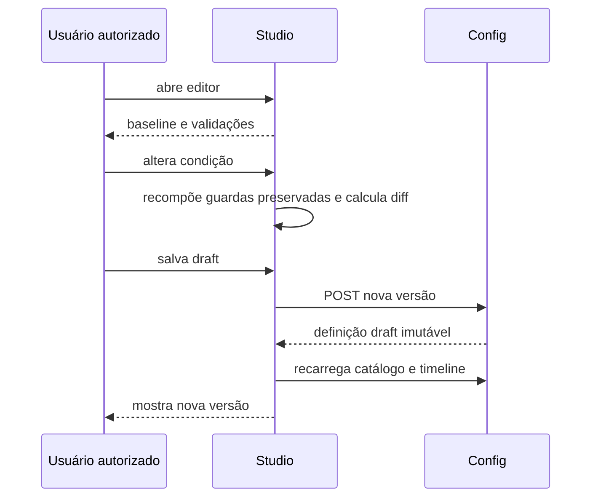

# Arquitetura e guia de continuidade

Este documento permite que uma pessoa ou agente continue o Praxis Policy Studio
em outra máquina, mesmo sem acesso ao Ergon, Oracle, VPN ou repositórios privados.
Ele separa fatos verificáveis do estado atual, arquitetura pretendida e trabalho
futuro.

## 1. Modelo mental

O Studio não é um motor de regras nem um banco de configurações. Ele coordena
uma experiência sobre quatro owners independentes:

### Regra de ownership

| Responsabilidade | Owner canônico | O Studio pode fazer |
| --- | --- | --- |
| semântica de execução | Praxis Rules Engine e contrato de domínio | apresentar e validar compatibilidade |
| versões, ETag e lifecycle | Praxis Config | solicitar ações autorizadas e mostrar estado |
| facts e providers | host consumidor | mostrar contratos; não buscar diretamente |
| autorização e escopo | servidor/host | consumir capabilities; nunca inferir |
| transação e efeitos | host consumidor | explicar limites; nunca executar por conta própria |
| identidade e evidência do domínio | artefatos governados do domínio | consumir projeção por refs/digests |
| experiência de catálogo e authoring | Policy Studio | organizar, comparar, orientar e diagnosticar |

## 2. Repositórios e dependências

### Necessários para evoluir o core

- `praxis-policy-studio`: aplicação, testes, projeções e documentação;
- registry npm: pacotes públicos `@praxisui/*` usados pela UI.

### Necessários para integração remota

- `praxis-api-quickstart`: host de referência e autenticação de desenvolvimento;
- `praxis-config-starter`: owner dos endpoints e lifecycle do Config.

### Opcionais e específicos do primeiro consumidor

- `Techne-ErgonX-migracao`: fontes governadas para regenerar a projeção RN-013;
- host Java do ErgonX: integração de runtime;
- Oracle legado: somente para provas de paridade/autoridade do produto consumidor.

Não ter acesso aos itens opcionais **não bloqueia** correções no shell, catálogo,
UX, i18n, contratos internos, checker, fixtures ou authoring genérico.

## 3. Contratos principais

### 3.1 Runtime config

`public/app-config.json` escolhe:

- `fixture`: sem chamadas ao Config;
- `remote`: integração protegida com `configApiBaseUrl`;
- `locale`: `pt-BR` ou `en-US`.

O modo remoto sem endpoint é inválido. Erro remoto não pode virar fixture
silenciosamente.

### 3.2 DomainProjection

A projeção fornece um read model de apresentação, não uma regra executável. Seu
contrato contém:

- identidade e versão da projeção;
- referências com SHA-256 para artefatos-fonte;
- bounded context, RuleSet, versão do host contract e operações;
- decisões ordenadas com chave canônica, reason code e referências;
- schemas de facts com tipo, `nullable`, descrição, provider e evidências;
- limites das provas realizadas;
- evidência explícita da autoridade atual.

O checker deve falhar em duplicidade, lacuna, ordem não total, fact sem schema ou
authority divergente. Ele verifica consistência estrutural; não homologa sozinho
o significado de negócio.

### 3.3 Config read/write

O adapter atual usa, sob sessão autenticada:

- `GET /api/praxis/config/domain-rules/definitions`;
- `GET /api/praxis/config/domain-rules/definitions/capabilities`;
- `GET /api/praxis/config/domain-rules/definitions/{id}/timeline`;
- `POST /api/praxis/config/domain-rules/definitions` para criar nova versão draft.

A definição mais recente é escolhida pela maior versão da mesma `ruleKey`. A
edição só é habilitada quando o servidor devolve `CREATE_NEW_VERSION` para o ID
exato. O POST preserva o contrato da versão anterior, incrementa `version`, muda
`status` para `draft` e substitui somente a condição editada.

### 3.4 Sessão

O login de desenvolvimento usa `/auth/login` e cookie `HttpOnly`. O Studio não
armazena senha ou token. `401` significa sessão necessária; `403` é distinguido
entre sessão ausente e sessão válida sem permissão.

## 4. Fluxos implementados

### 4.1 Catálogo remoto

Se uma condição remota usar um fact fora da projeção governada, o carregamento
falha com diagnóstico em vez de exibir uma regra parcialmente confiável.

### 4.2 Nova versão draft

O fluxo termina no draft. Não existe chamada implícita de publish, materialize,
snapshot ou activate.

## 5. Estado atual verificável

| Capacidade | Estado | Evidência local |
| --- | --- | --- |
| shell, rota e i18n | implementada | `src/app`, testes e build |
| contrato de projeção | implementado | `domain-projection.ts` e checker Node |
| pacote RN-013 | 14 decisões versionadas | `public/projections/ergonx-rn013.v1.json` |
| fixture neutra | valida contrato do segundo consumidor | `quickstart-benefit-eligibility.v1.json` |
| leitura Config | implementada | service, testes e prova live documentada |
| sessão de desenvolvimento | implementada | `auth-session.service.ts` |
| capabilities | implementadas | ação `CREATE_NEW_VERSION` server-owned |
| inspeção | implementada | catálogo e `decision-inspection.ts` |
| editor | implementado para o slice focal | `local-draft-workspace.component.ts` |
| persistência | criação de versão draft | `newDraftVersionRequest` e testes |
| simulação | não implementada | roadmap |
| publicação/ativação/rollback | não implementados | roadmap |
| autoridade Java/produção | não alterada pelo Studio | projeção e docs de evidência |

O termo “implementado” acima significa código e prova no escopo indicado. Não
significa homologação de negócio nem readiness produtivo.

## 6. Trabalhar em outra máquina

### Caminho A — desenvolvimento hermético

Use este caminho para UI, acessibilidade, i18n, projeções, checkers, contratos e
testes. Não requer backend, Ergon ou Oracle.

1. clone o repositório;
2. execute `npm ci`;
3. configure localmente `mode: fixture`;
4. execute `npm run lint`, `npm test` e `npm run check:projections`;
5. inicie com `npm start` e abra a porta `4302`.

Limite atual: a rota de catálogo carrega diretamente a projeção RN-013
versionada. Isso permite desenvolvimento sem o legado, mas a descoberta e
seleção genérica de pacotes ainda precisa ser implementada.

### Caminho B — integração com o host de referência

Use este caminho para autenticação, leitura, capabilities, timeline e criação de
draft.

1. inicie um Quickstart compatível na porta oficial `8088`;
2. mantenha Studio e host no mesmo hostname para o cookie local `SameSite`;
3. use `mode: remote` e `configApiBaseUrl: http://localhost:8088`;
4. autentique com uma conta de desenvolvimento fornecida fora do repositório;
5. confirme que leitura anônima é negada e leitura autorizada funciona;
6. salve somente draft e confirme que a versão anterior não mudou.

### Caminho C — atualizar o pacote ErgonX

Este caminho exige um checkout governado da migração, mas não exige conexão ao
Oracle para a regeneração estática.

1. atualize os artefatos canônicos na fábrica;
2. execute `npm run generate:ergonx-projection -- <checkout>`;
3. revise mudanças de identidade, ordem, facts, evidências e authority;
4. execute `npm run check:projections`;
5. não aceite um diff apenas porque o JSON é válido: confira a origem governada.

## 7. Como analisar uma mudança

Antes de editar, responda:

1. **Qual é o job do usuário?** Evite criar componente por semelhança visual.
2. **Quem é o owner canônico?** Studio, Config, Engine, host ou domínio?
3. **A necessidade é genérica?** Cite pelo menos dois consumidores ou mantenha-a
   na projeção do produto.
4. **Há mudança de contrato público?** Se sim, faça mapa de impacto antes do patch.
5. **Algum estado está sendo inferido no browser?** Se sim, pare e corrija o
   servidor/capability.
6. **A prova pode ser repetida sem o sistema privado?** Acrescente teste ou fixture.
7. **A documentação distingue atual de planejado?** Não promova intenção a fato.

### Mapa mínimo de impacto

- owner canônico afetado;
- consumidores diretos;
- contrato/API/projeção alterada;
- compatibilidade e risco de breaking change;
- testes focais;
- artefatos derivados e documentação;
- evidência que um agente externo consegue reproduzir.

## 8. Estratégia de testes

| Mudança | Validação mínima |
| --- | --- |
| texto ou docs | links, `git diff --check` e coerência com código |
| projeção | `npm run check:projections` e testes do contrato |
| core TypeScript | `npm run lint` e `npm test` |
| build/dependência | `npm run build` |
| UI relevante | gates acima e inspeção desktop/narrow em `4302` |
| integração Config | prova autenticada, negação anônima e capability real |
| criação de draft | versão N intacta, versão N+1 draft e nenhuma ativação |
| futura ativação | teste de snapshot, head atômico, last-known-good e rollback |

Não use uma suíte verde como evidência de homologação semântica. Não use uma
prova visual como evidência de execução no host.

## 9. Roadmap recomendado

### Etapa 1 — generalizar leitura multi-pacote

- criar um índice/registry governado de projeções;
- remover o path RN-013 fixo do componente;
- permitir selecionar domínio e RuleSet;
- provar ErgonX e Quickstart sem branches por produto.

### Etapa 2 — completar authoring de draft

- suportar mais formas do contrato JSON Logic;
- melhorar diff semântico e diagnósticos;
- preservar round-trip de toda estrutura não editada;
- expandir editabilidade apenas por capabilities reais.

### Etapa 3 — validação e simulação

- integrar compilação/validação compatível com o Rules Engine;
- executar fixtures tipadas sem host privado;
- adicionar adapter opcional para simulação no host;
- guardar somente evidências redigidas e correlacionadas.

### Etapa 4 — revisão e publicação

- modelar pacote de revisão, blockers e pareceres;
- consumir transições de lifecycle do Config;
- exigir ETag e evitar lost update;
- separar propor, aprovar e publicar conforme capability/política.

### Etapa 5 — operação

- visualizar materialização, snapshots e head ativo;
- provar rotação de ETag, last-known-good e rollback;
- oferecer observabilidade e explicação de execução;
- concluir requisitos corporativos antes de produção.

### Etapa 6 — portfólio

- acompanhar cobertura por produto, domínio e RuleSet;
- medir lead time, blockers, paridade e dívida;
- ligar decisões a consumidores, versões e evidências sem duplicar semântica.

## 10. Dívidas e riscos conhecidos

- o catálogo atual está ligado ao arquivo RN-013, embora o core deva ser genérico;
- a fixture Quickstart é validada pelo checker, mas ainda não aparece na UI;
- apenas um slice focal está editável;
- simulação e execução runtime ainda não são capacidades do Studio;
- documentação de evidência histórica pode ficar stale e deve registrar commits;
- uma projeção válida pode continuar semanticamente não homologada;
- capabilities incompletas devem reduzir ações, nunca ser compensadas no cliente;
- o modo fixture é desenvolvimento hermético, não substituto de prova integrada.

## 11. Checklist de handoff

Antes de entregar trabalho a outro agente, registre:

- objetivo e issue;
- branch e commit-base;
- classificação da mudança e owner;
- arquivos alterados e por quê;
- comandos executados e resultados;
- o que não foi testado;
- fixtures ou dados necessários;
- limites de autoridade;
- riscos, decisões pendentes e próximo menor passo verificável.

Nunca inclua credenciais no handoff. Se a tarefa depender de acesso privado,
ofereça primeiro uma fixture ou prova hermética equivalente e identifique
separadamente o gate de integração.
