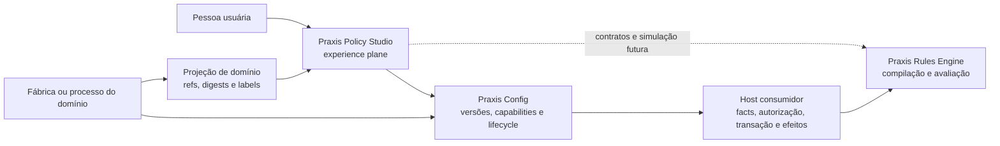
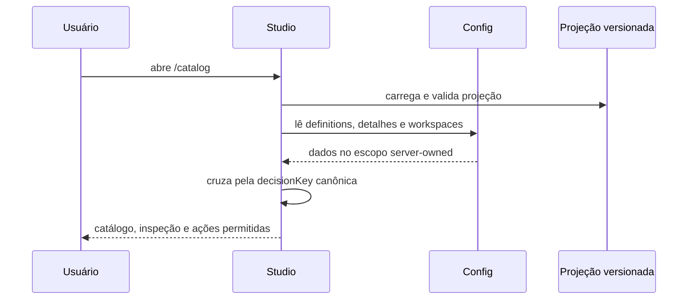
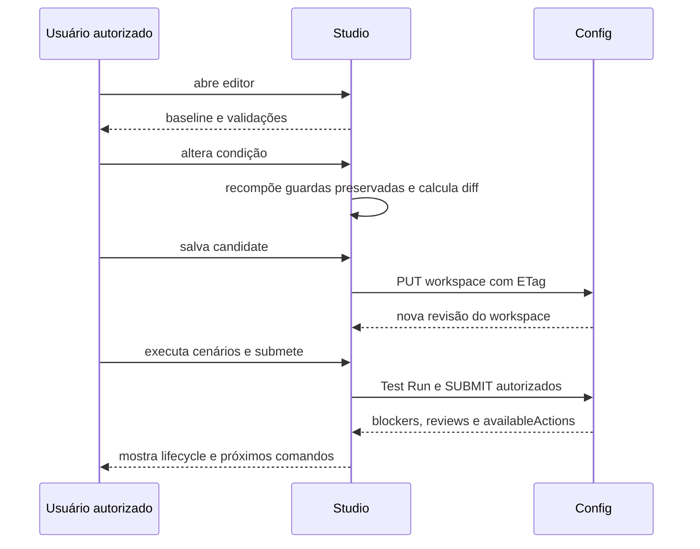

# Arquitetura e guia de continuidade

Este documento permite que uma pessoa ou agente continue o Praxis Policy Studio
em outra máquina, mesmo sem acesso ao Ergon, Oracle, VPN ou repositórios privados.
Ele separa fatos verificáveis do estado atual, arquitetura pretendida e trabalho
futuro.

## 1. Modelo mental

O Studio não é um motor de regras nem um banco de configurações. Ele coordena
uma experiência sobre quatro owners independentes:

### Regra de ownership

| Responsabilidade | Owner canônico | O Studio pode fazer |
| --- | --- | --- |
| semântica de execução | Praxis Rules Engine e contrato de domínio | apresentar e validar compatibilidade |
| versões, ETag e lifecycle | Praxis Config | solicitar ações autorizadas e mostrar estado |
| facts e providers | host consumidor | mostrar contratos; não buscar diretamente |
| autorização e escopo | servidor/host | consumir capabilities; nunca inferir |
| transação e efeitos | host consumidor | explicar limites; nunca executar por conta própria |
| identidade e evidência do domínio | artefatos governados do domínio | consumir projeção por refs/digests |
| experiência de catálogo e authoring | Policy Studio | organizar, comparar, orientar e diagnosticar |

## 2. Repositórios e dependências

### Necessários para evoluir o core

- `praxis-policy-studio`: aplicação, testes, projeções e documentação;
- registry npm: pacotes públicos `@praxisui/*` usados pela UI.

### Necessários para integração remota

- `praxis-api-quickstart`: host de referência e autenticação de desenvolvimento;
- `praxis-config-starter`: owner dos endpoints e lifecycle do Config.

### Opcionais e específicos do primeiro consumidor

- `Techne-ErgonX-migracao`: fontes governadas para regenerar a projeção RN-013;
- host Java do ErgonX: integração de runtime;
- Oracle legado: somente para provas de paridade/autoridade do produto consumidor.

Não ter acesso aos itens opcionais **não bloqueia** correções no shell, catálogo,
UX, i18n, contratos internos, checker, fixtures ou authoring genérico.

## 3. Contratos principais

### 3.1 Runtime config

`public/app-config.json` escolhe:

- `fixture`: sem chamadas ao Config;
- `remote`: integração protegida com `configApiBaseUrl`;
- `locale`: `pt-BR` ou `en-US`.

O modo remoto sem endpoint é inválido. Erro remoto não pode virar fixture
silenciosamente.

### 3.2 DomainProjection

A projeção fornece um read model de apresentação, não uma regra executável. Seu
contrato contém:

- identidade e versão da projeção;
- referências com SHA-256 para artefatos-fonte;
- bounded context, RuleSet, versão do host contract e operações;
- decisões ordenadas com chave canônica, reason code e referências;
- schemas de facts com tipo, `nullable`, descrição, provider e evidências;
- limites das provas realizadas;
- evidência explícita da autoridade atual.

O checker deve falhar em duplicidade, lacuna, ordem não total, fact sem schema ou
authority divergente. Ele verifica consistência estrutural; não homologa sozinho
o significado de negócio.

### 3.3 Config read/write

O adapter atual usa o `DomainRuleService` público, sob sessão autenticada, para:

- listar e detalhar definitions e timeline;
- listar, criar e alterar change workspaces com ETag;
- consumir capabilities, blockers, cenários, Test Runs, reviews e promoção do
  workspace;
- consultar readiness e solicitar publicação/materialização;
- consultar snapshots, head, resumos de execução/hosts, rollout-policy e staged
  rollout, executando os comandos já expostos pelo client.

A definição mais recente é escolhida pela maior versão da mesma `ruleKey` e a
condição é obtida por leitura de detalhe. A projeção estática informa somente se
o tipo de decisão possui suporte de authoring. A criação inicial de workspace é
exibida e executada apenas quando o client público recebe
`CREATE_NEW_VERSION` de `GET /definitions/capabilities` para o identificador,
`ruleKey` e versão exatos da definição. Metadata da projeção nunca é tratada como
autorização.

Depois que o workspace existe, save, cenários, Test Run, submit, review e promoção
usam `availableActions` e ETag server-owned. Publicação ainda é apresentada a partir
do readiness; create rollout e comandos de rollout-policy ainda são derivados do
lifecycle. Essas lacunas exigem actions próprias no Config, não condicionais novas
no browser.

### 3.4 Sessão

O login de desenvolvimento usa `/auth/login` e cookie `HttpOnly`. O Studio não
armazena senha ou token. `401` significa sessão necessária; `403` é distinguido
entre sessão ausente e sessão válida sem permissão.

## 4. Fluxos implementados

### 4.1 Catálogo remoto

Se uma condição remota usar um fact fora da projeção governada, o carregamento
falha com diagnóstico em vez de exibir uma regra parcialmente confiável.

### 4.2 Change workspace e lifecycle explícito

Nenhuma etapa é implícita. O Studio já materializa review, promoção, readiness,
publicação, snapshots e staged rollout em ações separadas. O browser não compõe o
snapshot nem executa a regra. Actions incompletas devem ocultar o comando até o
Config publicar a capability correta.

## 5. Estado atual verificável

| Capacidade | Estado | Evidência local |
| --- | --- | --- |
| shell e rota | implementados | `src/app`, testes e build |
| i18n | parcial | catálogo usa resources, mas ainda existem literais pt/en no chrome |
| contrato de projeção | implementado | `domain-projection.ts` e checker Node |
| pacote RN-013 | 14 decisões versionadas | `public/projections/ergonx-rn013.v1.json` |
| fixture neutra | valida contrato do segundo consumidor | `quickstart-benefit-eligibility.v1.json` |
| leitura Config | implementada no slice | service, detalhe, testes e prova live documentada |
| sessão de desenvolvimento | implementada | `auth-session.service.ts` |
| capabilities | parciais | workspace, snapshots e staged rollout possuem ações server-owned; publicação, criação de rollout e rollout-policy ainda requerem catálogos próprios |
| inspeção | parcial | catálogo e `decision-inspection.ts`; falta causalidade runtime |
| editor | implementado para condição focal | Visual Builder; parâmetros/outcomes/RuleSet completo ausentes |
| persistência | workspace concorrente com ETag | `ProjectionCatalogService` e testes de integração |
| simulação | candidate × active e transporte V58 implementados; provenance operacional parcial | cenários/Test Runs do Config, sandbox host-owned, baseline independente por cenário, retry idempotente e gates opt-in de SUBMIT/PROMOTE; ainda faltam adapter remoto/Neon/Oracle e gates posteriores |
| publicação/ativação/rollback | parcialmente implementados | readiness/materializações, snapshot e staged rollout; actions de publicação, criação de rollout e rollout-policy precisam ser server-owned |
| assistente de decisões | planejado sobre runtime existente | Config/`@praxisui/ai` fornecem a base horizontal; faltam tools e projeção de evidência de domínio |
| autoridade Java/produção | não alterada pelo Studio | projeção e docs de evidência |

O termo “implementado” acima significa código e prova no escopo indicado. Não
significa homologação de negócio nem readiness produtivo.

## 6. Trabalhar em outra máquina

### Caminho A — desenvolvimento hermético

Use este caminho para UI, acessibilidade, i18n, projeções, checkers, contratos e
testes. Não requer backend, Ergon ou Oracle.

1. clone o repositório;
2. execute `npm ci`;
3. configure localmente `mode: fixture`;
4. execute `npm run lint`, `npm test` e `npm run check:projections`;
5. inicie com `npm start` e abra a porta `4302`.

Limite atual: a rota carrega uma única projeção definida por `projectionPath`.
O arquivo versionado padrão é o caso Quickstart; RN-013 também está versionado,
mas não há discovery/registry governado nem seleção multi-pacote na UI.

### Caminho B — integração com o host de referência

Use este caminho para autenticação, leitura, workspace, cenários, lifecycle,
readiness, publicação e cockpit operacional dentro das ações disponíveis.

1. inicie um Quickstart compatível na porta oficial `8088`;
2. mantenha Studio e host no mesmo hostname para o cookie local `SameSite`;
3. use `mode: remote` e `configApiBaseUrl: http://localhost:8088`;
4. autentique com uma conta de desenvolvimento fornecida fora do repositório;
5. confirme que leitura anônima é negada e leitura autorizada funciona;
6. prove ETag, capability negativa e as transições que a persona realmente possui;
7. não trate o Test Run V58 como paridade Oracle: o contrato e os gates existem,
   mas o adapter Ergon, os quatro canários reais e a prova Neon/Oracle permanecem externos.

### Caminho C — atualizar o pacote ErgonX

Este caminho exige um checkout governado da migração, mas não exige conexão ao
Oracle para a regeneração estática.

1. atualize os artefatos canônicos na fábrica;
2. execute `npm run generate:ergonx-projection -- <checkout>`;
3. revise mudanças de identidade, ordem, facts, evidências e authority;
4. execute `npm run check:projections`;
5. não aceite um diff apenas porque o JSON é válido: confira a origem governada.

## 7. Como analisar uma mudança

Antes de editar, responda:

1. **Qual é o job do usuário?** Evite criar componente por semelhança visual.
2. **Quem é o owner canônico?** Studio, Config, Engine, host ou domínio?
3. **A necessidade é genérica?** Cite pelo menos dois consumidores ou mantenha-a
   na projeção do produto.
4. **Há mudança de contrato público?** Se sim, faça mapa de impacto antes do patch.
5. **Algum estado está sendo inferido no browser?** Se sim, pare e corrija o
   servidor/capability.
6. **A prova pode ser repetida sem o sistema privado?** Acrescente teste ou fixture.
7. **A documentação distingue atual de planejado?** Não promova intenção a fato.

### Mapa mínimo de impacto

- owner canônico afetado;
- consumidores diretos;
- contrato/API/projeção alterada;
- compatibilidade e risco de breaking change;
- testes focais;
- artefatos derivados e documentação;
- evidência que um agente externo consegue reproduzir.

## 8. Estratégia de testes

| Mudança | Validação mínima |
| --- | --- |
| texto ou docs | links, `git diff --check` e coerência com código |
| projeção | `npm run check:projections` e testes do contrato |
| core TypeScript | `npm run lint` e `npm test` |
| build/dependência | `npm run build` |
| UI relevante | gates acima e inspeção desktop/narrow em `4302` |
| integração Config | prova autenticada, negação anônima e capability real |
| criação de draft | versão N intacta, versão N+1 draft e nenhuma ativação |
| futura ativação | teste de snapshot, head atômico, last-known-good e rollback |

Não use uma suíte verde como evidência de homologação semântica. Não use uma
prova visual como evidência de execução no host.

## 9. Roadmap recomendado

O roadmap, percentuais, bloqueadores corporativos, gate de evidência e critérios de
release são mantidos em [Estado e roadmap](current-status-and-roadmap.md). A
fronteira da IA está em [ADR 0002 — Policy Assistant](adr/0002-policy-assistant-boundary.md).

## 10. Dívidas e riscos conhecidos

- o catálogo carrega um único `projectionPath`; não existe discovery multi-pacote;
- apenas um slice focal está editável;
- comparison candidate × active, baseline independente por resultado e idempotência
  do Test Run existem; adapter remoto e prova Oracle ainda são lacunas de integração;
- workspace usa actions server-owned, mas Definition create, publicação, create
  rollout e rollout-policy ainda não possuem consumo completo de capabilities;
- a role leitora diverge entre host e controller Config em corporate mode;
- a V58 governa `SUBMIT`/`PROMOTE` por política opt-in; publication, snapshot e
  activation ainda precisam vincular e revalidar o mesmo receipt;
- o corte Quickstart V58 hospeda a prova local e a explicação consultiva do Config;
  isso não transforma o host em owner da projeção de evidência;
- documentação de evidência histórica pode ficar stale e deve registrar commits;
- uma projeção válida pode continuar semanticamente não homologada;
- capabilities incompletas devem reduzir ações, nunca ser compensadas no cliente;
- o modo fixture é desenvolvimento hermético, não substituto de prova integrada.

## 11. Checklist de handoff

Antes de entregar trabalho a outro agente, registre:

- objetivo e issue;
- branch e commit-base;
- classificação da mudança e owner;
- arquivos alterados e por quê;
- comandos executados e resultados;
- o que não foi testado;
- fixtures ou dados necessários;
- limites de autoridade;
- riscos, decisões pendentes e próximo menor passo verificável.

Nunca inclua credenciais no handoff. Se a tarefa depender de acesso privado,
ofereça primeiro uma fixture ou prova hermética equivalente e identifique
separadamente o gate de integração.
